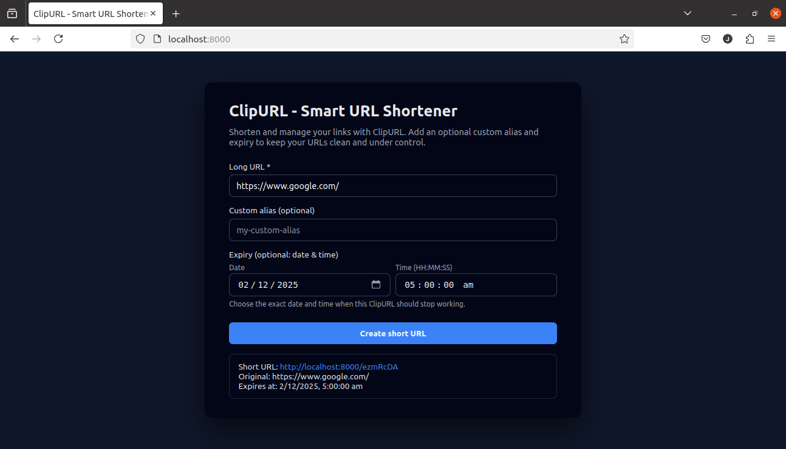

# ClipURL - Smart & Scalable URL Shortener (Node.js, MongoDB, Redis, React)

ClipURL is a production-ready URL shortener with:

- Deterministic hash-based short codes (SHA-256 + Base62, 7 characters)
- Optional custom aliases and expiry
- MongoDB persistence
- Redis cache layer for high-throughput reads
- Simple React single-page UI served by Express
- Idempotent create API, designed for autoscaling

---

## Demo



> The screenshot above shows the main ClipURL page where you can enter a long URL, optional custom alias, and expiry (date & time), then see the generated short URL.

---

## Features

- **Deterministic short codes**
  - Uses `sha256(longUrl + attempt)` + Base62 to generate 7-character codes.
  - Same `longUrl` and parameters produce the same code across instances.
  - Handles rare collisions deterministically by incrementing `attempt`.

- **Custom aliases**
  - Users can choose their own alias (e.g. `https://your-domain/my-link`).
  - Validation: `^[0-9a-zA-Z_-]{3,50}$`.
  - Aliases are unique per code; multiple codes can point to the same long URL (e.g. different marketing links).

- **Expiry**
  - Optional exact expiry (date + time, down to seconds).
  - Expired links return HTTP `410 Gone`.
  - MongoDB TTL index can automatically clean up expired documents.

- **MongoDB persistence**
  - Short URLs survive server restarts.
  - Unique index on `code` ensures no duplicate short codes.

- **Redis caching**
  - **Read path**: cache-aside.
    - Check Redis first; on miss, fall back to MongoDB and populate the cache.
  - **Write path**: write-through (cache first, then DB).
    - On DB failure, the cache entry is rolled back.
  - TTL in Redis respects `expiresAt` when provided.

- **Autoscale-safe & idempotent create**
  - `POST /api/shorten` is idempotent across instances for the same payload.
  - If multiple instances race to create the same code for the same `longUrl`, one wins the DB write; others treat Mongo duplicate key (11000) as success if the existing mapping matches the requested `longUrl`.

- **Simple React UI**
  - One-page app with:
    - Long URL (required)
    - Custom alias (optional)
    - Expiry (optional date + time, with clear labels)
  - Displays the resulting short URL and expiry in a result card.

---

## Tech Stack

- **Backend**
  - Node.js
  - Express 5
  - MongoDB + Mongoose
  - Redis (`redis` v4)
- **Frontend**
  - React 18 (via UMD CDN)
  - Single HTML file served by Express from `public/index.html`
- **Other**
  - Nodemon for local development
  - `dotenv` for environment variables

---

## Project Structure

```text
.
├─ app.js                # Express app (middleware + routes)
├─ server.js             # Local development entrypoint
├─ public/
│  └─ index.html         # React SPA (ClipURL UI)
├─ config/
│  ├─ db.js              # MongoDB connection
│  └─ redis.js           # Redis connection
├─ models/
│  └─ Url.js             # Mongoose model for shortened URLs
├─ controllers/
│  └─ urlController.js   # createShortUrl + redirectToLongUrl logic
├─ routes/
│  └─ urlRoutes.js       # /api/shorten and /:code routes
├─ utils/
│  └─ shortCode.js       # SHA-256 + Base62 short code generator
├─ package.json
└─ README.md
```

---

## Data Model

`models/Url.js` defines the schema:

- `code` (`String`, **unique**, indexed): 7-character (or custom) short code.
- `longUrl` (`String`): original URL.
- `expiresAt` (`Date`, optional): when the short URL stops working.
- `createdAt`, `updatedAt` (from `timestamps: true`).
- TTL index on `expiresAt` so MongoDB can automatically remove expired URLs.

Multiple short codes can legitimately point to the same `longUrl` (e.g. one auto-generated code plus multiple custom marketing aliases).

---

## API

### POST `/api/shorten`

Create (or retrieve) a short URL.

**Request body (JSON):**

```json
{
  "longUrl": "https://example.com/very/long/path",
  "customAlias": "my-promo-link",   
  "expiry": "2025-12-31T23:59:59"   
}
```

- `longUrl` (required): must be a valid URL.
- `customAlias` (optional): 3–50 chars, letters/numbers/`-`/`_`.
- `expiry` (optional): ISO-like date-time string (e.g. `YYYY-MM-DDTHH:MM:SS`).

**Successful response (`200 OK`):**

```json
{
  "shortUrl": "https://your-domain/abc12Xy",
  "code": "abc12Xy",
  "longUrl": "https://example.com/very/long/path",
  "expiresAt": "2025-12-31T23:59:59.000Z" 
}
```

**Error responses:**

- `400 Bad Request`
  - Missing `longUrl`
  - Invalid URL
  - Invalid `customAlias` format
  - Invalid `expiry` format
- `409 Conflict`
  - `customAlias` is already used for a **different** `longUrl`.
- `500 Internal Server Error`
  - DB/cache failures or unexpected errors.

### GET `/:code`

Redirect a short code to its long URL.

**Behavior:**

- Checks Redis cache first (cache-aside).
- Falls back to MongoDB on cache miss, then populates Redis.
- If `expiresAt` is in the past:
  - Returns `410 Gone`.
- If code does not exist:
  - Returns `404 Not Found`.

This route skips paths that look like static assets (e.g. containing `.`) so that Express static middleware can handle files under `public/`.

---

## Caching Strategy

- **Key format**: `url:<code>`
- **Value**: JSON `{ longUrl, expiresAt }`.
- **TTL**:
  - If `expiresAt` is set: TTL = `expiresAt - now` (seconds).
  - If no expiry: no TTL (relies on Redis eviction policy).

**Reads (redirect):**

1. Try Redis.
   - Hit → redirect to cached `longUrl`.
   - Hit but expired → delete key and return `410 Gone`.
   - Miss → read from MongoDB.
2. From MongoDB.
   - Not found → `404 Not Found`.
   - Expired → `410 Gone`.
   - Valid → cache the result and redirect.

**Writes (create/update):**

1. Generate deterministic code via SHA-256 + Base62 (`generateShortCode`).
2. Write to cache first (write-through).
3. Write to MongoDB.
4. On Mongo duplicate key error (11000):
   - If existing doc has same `longUrl` → treat as success (idempotent across autoscaled instances).
   - Else → treat as alias conflict (`409`) and roll back cache entry.

---

## Environment Variables

- `MONGO_URI` – MongoDB connection string (required).
- `REDIS_URL` **or** (`REDIS_HOST`, `REDIS_PORT`, `REDIS_PASSWORD`) – Redis connection config.
- `PORT` – Port for local development (default: `8000`).


---

## Running Locally

### 1. Install dependencies

```bash
npm install
```

### 2. Configure environment variables

```bash
MONGO_URI="mongodb://localhost:27017/clipurl"
REDIS_URL="redis://localhost:6379"
```

### 4. Start the dev server

```bash
npm start
# runs nodemon server.js
```

Open the app at:

- Frontend: `http://localhost:8000/`
- API: `POST http://localhost:8000/api/shorten`

---

## License

MIT (or update to your preferred license).
# ClipURL---Smart-URL-Shortener
